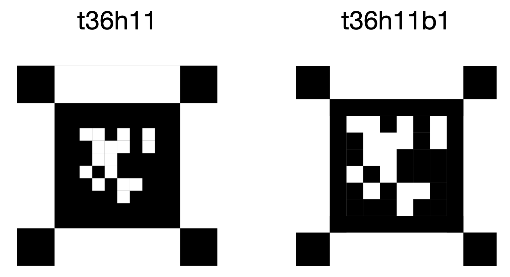

# Aprilgrid

### Pure python version of aprilgrid
Inspired by [Apriltag](https://github.com/AprilRobotics/apriltag) and [Kalibr](https://github.com/ethz-asl/kalibr). There's lot of existing python binding of apriltag. But as everyone knows, python binding causes a lot of issues. So I rewrite a pure python version of apriltag and it's also able to detect aprilgrid.


## Install from PyPI
```
pip install aprilgrid
```

## Usage
Some examples of usage can be seen in the example/main.py file.

```py
from aprilgrid import Detector

detector = Detector("t36h11")

detector.detect(img)
```

Kalibr uses 2 bit black border while apriltag3 uses 1 bit black border for each tag. The default of aprilgrid follows Kalibr. Please use `t36h11b1` if you're using tags with 1 bit black border.



## Development
```sh
git clone https://github.com/powei-lin/aprilgrid.git
cd aprilgrid
pip install -e .
```

## TODO
- [ ] Add output for opencv calibrate camera.
- [ ] Provide pregenerated pdf and easy way to customize.
- [ ] Support all tag families.
- [ ] Accelerate and multi-threading.
- [ ] Robustness.

## Reference
- https://github.com/AprilRobotics/apriltag
- https://github.com/ethz-asl/kalibr